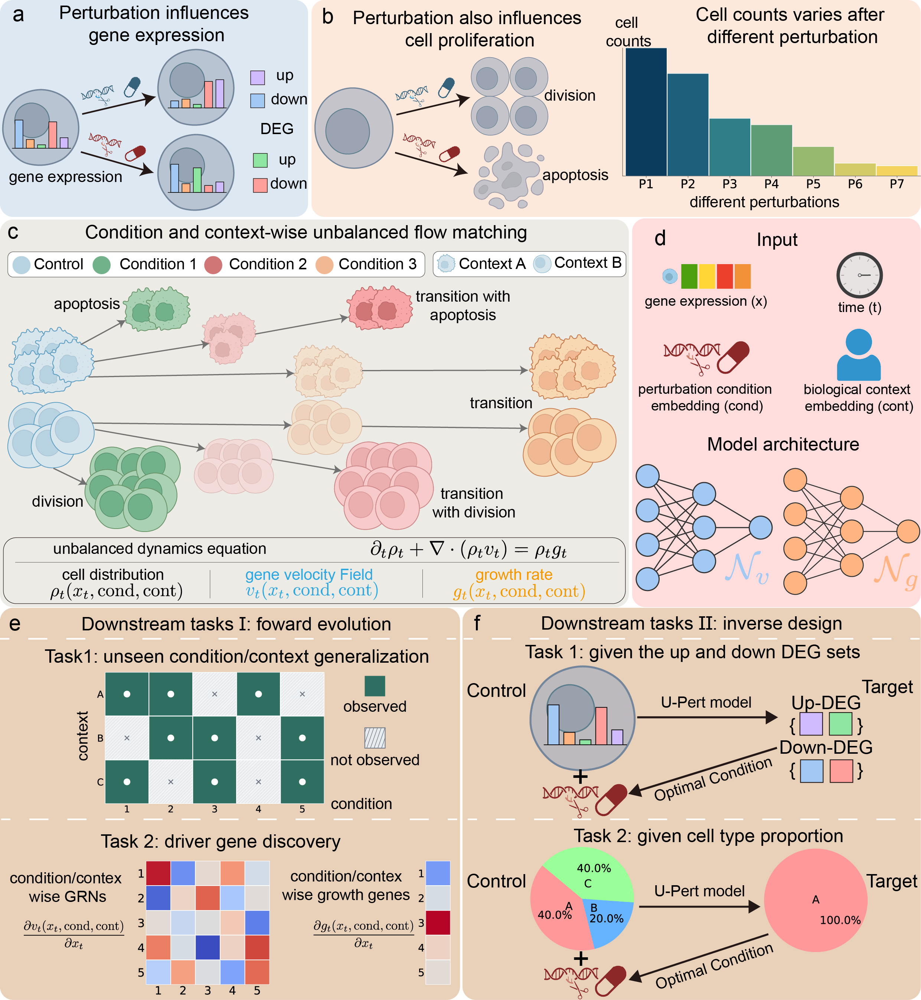

<div align=center>
<div align=center>

</div>
<h3>Unbalanced perturbation dynamics for cell fate design</h3>
</div>

<div align=center>
<h2>Enjoying U-Pert? Help us grow by clicking the ⭐ button!</h2>
</div>

[](https://www.python.org/)
[](https://pytorch.org/)
[](https://github.com/QiangweiPeng/U-Pert/stargazers)
[](https://github.com/QiangweiPeng/U-Pert/commits/main)
<!--
[](https://github.com/QiangweiPeng/U-Pert/network)
[](https://github.com/QiangweiPeng/U-Pert/issues)
[](https://github.com/QiangweiPeng/U-Pert/blob/main/LICENSE)
-->

## **U-Pert**: From perturbation prediction to cell-fate design

Single-cell perturbation experiments capture cells before and after a gene knockout, cytokine stimulation, or drug treatment, but the dynamic process in between remains hidden. **U-Pert** reconstructs this missing process from destructive and unpaired snapshots by jointly modeling transcriptomic state transitions and cell birth-death dynamics.

U-Pert supports both **forward prediction** of perturbation responses and **inverse design** of perturbations that achieve desired outcomes, such as target DEG programs or cell-type compositions.

<div align=center>

</div>

## 🌟 Highlights of U-Pert

* **Joint modeling of perturbation-induced cell-state transitions and birth-death dynamics**
  * U-Pert learns both transcriptomic state changes and cell proliferation/apoptosis from destructive, unpaired single-cell perturbation snapshots.

* **Inverse design for cell-fate engineering**
  * Given desired post-perturbation outcomes, such as target DEG programs or cell-type compositions, U-Pert can screen effective genetic edits or drug perturbations in silico.

## 🚀 What can U-Pert do?

| Mode | Task | What U-Pert enables |
| --- | --- | --- |
| **Forward evolution** | **Generalization to unseen perturbations and contexts** | Predict cellular responses under unseen perturbations, unseen biological contexts, or unobserved condition-context combinations. |
| **Forward evolution** | **Condition- and context-specific mechanism discovery** | Infer perturbation/context-specific GRNs from the Jacobian of the learned velocity field, and identify growth-driver genes from the gradient of the learned growth field. |
| **Inverse design** | **Target DEG programs** | Screen effective gene-editing or drug perturbations that induce desired up- and down-regulated DEG sets. |
| **Inverse design** | **Target cell-type outcomes** | Search for perturbations that achieve desired cell-type proportions or absolute cell quantities. |

## 🛠 Installation

### 📦 PyPI

A stable PyPI release of **U-Pert** is coming soon.

### 🔨 Manual installation

Install the development version directly from GitHub:

```bash
git clone https://github.com/QiangweiPeng/U-Pert.git
cd U-Pert

conda create -n upert python=3.10 -y
conda activate upert

pip install -e .
```

<!-- ## 📁 Repository structure

```text
U-Pert/
├── upert/                      # Core model, training, and inference code
├── notebooks/                  # Reproducible notebooks for simulations and real data
├── scripts/                    # Command-line training and evaluation scripts
├── data/                       # Data download/preprocessing instructions
├── figures/                    # Scripts and source files for manuscript figures
├── docs/source/_static/         # Static assets used in this README and documentation
│   └── figure1.png             # Overview figure shown above
├── environment.yml             # Conda environment file
├── pyproject.toml              # Package configuration
└── README.md
``` -->

<!-- ## 📖 Citation

If you use **U-Pert** in your research, please cite:

> **Unbalanced perturbation dynamics for cell fate design. Manuscript in preparation.**

```bibtex
@article{2026upert,
  title={Unbalanced perturbation dynamics for cell fate design},
  author={},
  year={2026},
  note={Manuscript in preparation}
}
``` -->

## 📢 News

* Tutorials, and reproducible notebooks will be released soon.

## 🏗 Contributing

We welcome contributions from the community. Whether you are fixing a bug, improving documentation, adding a dataset interface, or extending U-Pert to new perturbation modalities, your help is appreciated.

